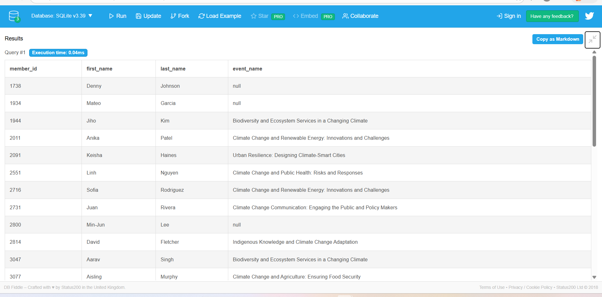
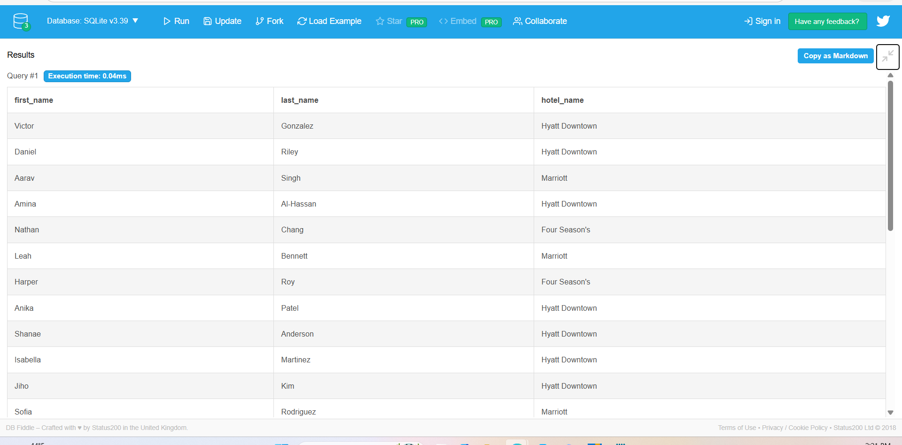
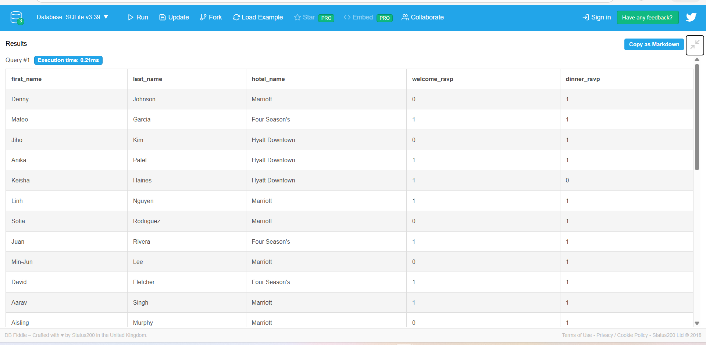
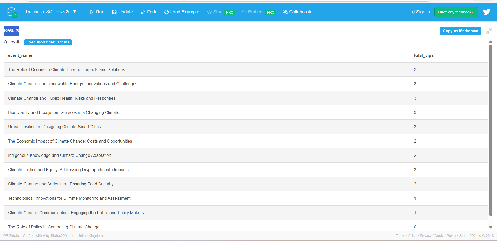
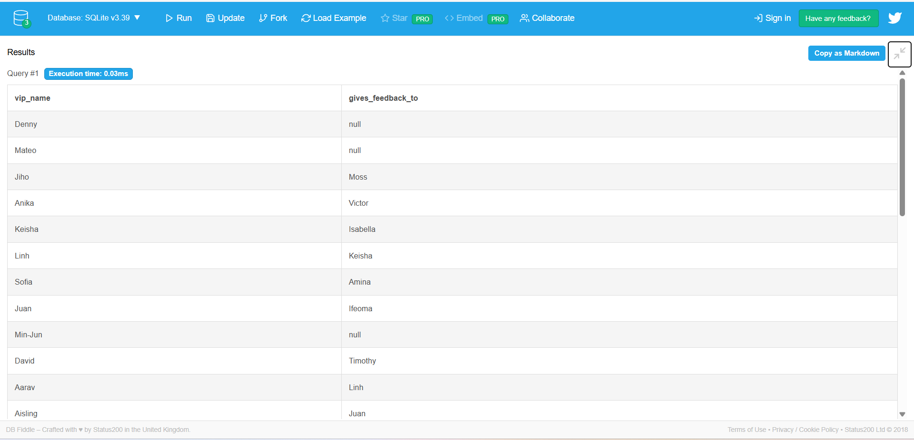
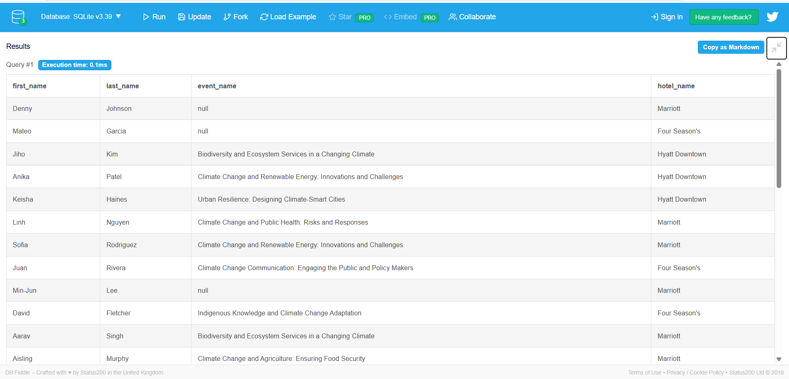

# 📊 VIP SQL Join Insights

This document summarizes the insights from the six SQL join queries in this project. The queries involve VIPs, events, hotel reservations, and RSVP/feedback tracking. Screenshots of query results are in the `joinresults/` folder.  

---

## 1️⃣ VIPs and Their Event Names (LEFT JOIN)

**Query:** `join1.sql`  

**Insight:**  
- Lists all VIP members and their associated events.  
- Includes VIPs **who are not yet assigned to any event**.  
- Useful for spotting unassigned VIPs before an event.

---

## 2️⃣ VIP Hotel Reservations (INNER JOIN)

**Query:** `join2.sql`  

**Insight:**  
- Shows VIPs **with confirmed hotel reservations** and the hotel name.  
- Only VIPs with reservations are included.  
- Helps track VIP accommodations.

---

## 3️⃣ VIP RSVP Status (MULTIPLE JOIN)

**Query:** `join3.sql`  

**Insight:**  
- Combines VIP info, hotel reservations, and RSVP status (welcome & dinner).  
- Identifies VIPs **who haven’t RSVP’d** or don’t have a hotel reservation.  
- Useful for planning event attendance and accommodations.

---

## 4️⃣ Count VIPs per Event (Aggregation Join)

**Query:** `join4.sql`  

**Insight:**  
- Calculates **total VIPs attending each event**.  
- Highlights **most popular events**.  
- Ensures events with **zero VIPs are still included** using `LEFT JOIN`.

---

## 5️⃣ SELF JOIN: Who Gives Feedback To Whom

**Query:** `join5.sql`  

**Insight:**  
- Maps **feedback relationships** between VIPs.  
- Shows which VIP gives feedback to whom.  
- `LEFT JOIN` ensures VIPs without feedback assignments are still shown.

---

## 6️⃣ VIP + Event + Hotel Combined Analytics

**Query:** `join6.sql`  

**Insight:**  
- Combines all VIP info with events and hotel reservations.  
- Provides a **complete overview of VIP participation**.  
- Useful for overall event planning and analytics.

---

## ✅ Key Takeaways

- `LEFT JOIN` ensures no VIP or event is missed, even if missing data exists.  
- Aggregation queries show **event popularity**.  
- Self-joins reveal **relationships between VIPs**.  
- Combined analytics provide **a single table for full VIP overview**.

---

*All SQL queries are available in the root folder, and screenshots are in `joinresults/`.*